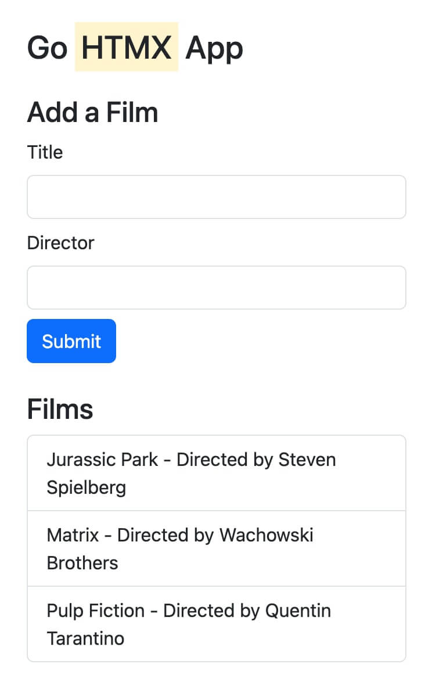

# Go HTMX

This is a simple example of how to use HTMX with Go

> Note: We also used bootstrap for styling

#### Screenshot



## How to run

- Clone this repository and `cd` into it
- Make sure you have [Go](https://go.dev/learn/) installed on your machine, then run:

```bash
go run main.go

#or, if you have Gomon installed:
gomon main.go
```

Then open your browser and go to `http://localhost:3000`

> Tip: [Gomon](https://github.com/JulesGuesnon/Gomon) is a command line tool similar to nodemon but for Go, it will automatically restart your server when you make changes to your code

### Resources

- [HTMX](https://htmx.org/)
- [Bootstrap](https://getbootstrap.com/)
- [Go](https://go.dev/)
- [Gomon](https://github.com/JulesGuesnon/Gomon)
- [Go Templates](https://pkg.go.dev/text/template)
- [Go Templates easy tutorial](https://golangforall.org/en/post/templates.html)

## License

- [MIT](LICENSE.md)
